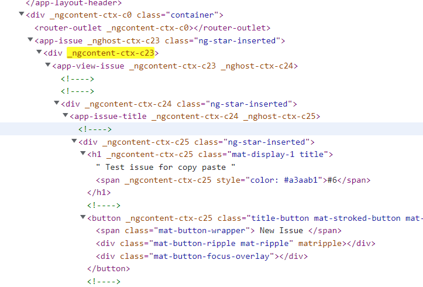
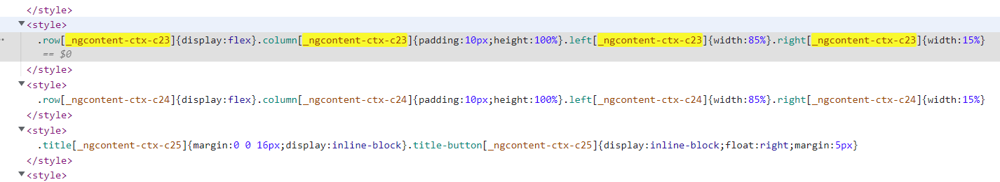

### Observer design pattern (in rxjs)

In CS2103/T, I learnt about the Observer design pattern but I did not really see it being used often until I had to work with rxjs in Angular.

Observables are used in Angular to provide a form of lazy transfer of data to the observer in both a synchronous and asynchronous manner, in a beautiful functional programming style. For example, if we want to get API data of the authenticated user from github, we can call

```typescript
const observable = from(octokit.users.getAuthenticated()).pipe(
    map((response) => response['data']),
    catchError((err) => throwError('Failed to fetch authenticated user.'))
);
```

`from(...)` will convert the `Promise` object `octokit.users.getAuthenticated()` into an observable. We can then change the values returned by this promise by using `pipe(...)`. In the example, the `map(...)` function in the pipe will only retrieve the `'data'` values of the response from the API call. Afterwards, we can subscribe to the observable somewhere else by calling `subscribe(...)`. In the example below, we will subscribe to the observable and print the data to the console.

```typescript
observable.subscribe((data) => console.log(data));
```

rxjs provides a wide range of transformation operators (such as map) that will make programming with lazy data (like asynchronous API calls) easier. For more information, visit [https://rxjs.dev/guide/overview](https://rxjs.dev/guide/overview).

### Logging

Though it might seem to be redundant at first, log messages are helpful to developers when users report a bug that cannot be resolved easily. In CATcher, logging is used at various levels, from logging error messages to logging network HTTP requests to the github server. The octokit API library that is used to perform API requests to the Github server allows developers to customize the various logging levels, so that there is no need to manually hard-code the logging messages for every method that has a Github API call. By separating the various logging levels, developers can easily filter through the less important messages if there is a critical error. There are usually 4 levels of logging for the console (other than the general `console.log`), shown below in increasing severity:

1. **debug**: Provides useful information to the developer in development mode. Usually debug messages are not very useful in production, especially for CATcher, since they take up a lot of space in the log. An example of a debug message can be the HTTP request details of an API call to Github.
2. **info**: Provides information about a less important event occuring or a state change. Such information is not very important to the developers, but in certain situations, the developer may find such messages helpful.
3. **warn**: Provides an important warning to the developer if there is an unexpected situation or bad code, but the application can continue to work. Developers should take note of such warnings and address these warnings if possible.
4. **error**: Provides an important error message to the developer if one or more components of the application fails and stop functioning properly. This usually constitutes as a bug that developers should work on promptly.

### View Encapsulation

Suppose you want to create an Angular component which contains a child component that needs to be styled. The best way is to apply the CSS styles to the child itself. But sometimes, it is not possible or just too tedious. For example, in this CATcher PR, I want to apply markdown-like CSS styles to a custom generated HTML code. To do this, I have to put the HTML inside an article tag, set the class of the article to "markdown-body", and let the css file handle the styling. However, the CSS styles did not get applied to the generated HTML. Why?

To solve this issue, we will have to learn about view encapsulation in Angular. There are currently 3 types of view encapsulation in Angular: ShadowDom, Emulated (default) and None. The table below summarizes the different view encapsulation modes.

| View Encapsulation | Description |
| ---- | ---- |
| ShadowDOM | In Angular, ShadowDOM uses the browsers's internal Shadow DOM API to encapsulate/hide the Angular component's view inside a ShadowRoot and applies the styles specified only to the component itself. See [mdn docs](https://developer.mozilla.org/en-US/docs/Web/Web_Components/Using_shadow_DOM) for more details on what is ShadowDOM. The drawback of this is that some browsers may not support ShadowDOM (but major browsers like Chrome and Firefox support ShadowDOM). |
| Emulated | This is the default view encapsulation in Angular. It emulated the behaviour of ShadowDOM, without using ShadowDOM. Angular does this by adding unique attributes to the component templates and edits the css by applying the attributes too. See the picture below for an example. |
| None | Perhaps the easiest to understand. Unlike ShadowDOM and Emulated, the HTML and CSS is untouched. However, this can cause the CSS to be applied to the entire webpage. We try to avoid using this if possible, in case of styling conflicts. |

Example of emulated view encapsulation:



Notice that there is a special `_ngcontent-ctx-c23` attribute applied to the elements within `app-issue` component, while the `app-issue` element itself acts as a "shadow host", hence the attribute `_nghost-ctx-c23`. However, the content of the child component `app-issue-title` will not have this attribute. In the bottom picture, we see that Angular has changed our CSS styles such that it will only be applied to elements with attributes such as `_ngcontent-ctx-c23`. This prevents the style from being applied throughout the web page, hence emulating the behaviour of ShadowDOM.

Going back to the initial question, why were the styles not applied to the generated HTML? This is because we were using the default emulated view encapsulation, so the imported CSS file will be edited to include the unique attribute `_ngcontent-ctx-cXX`. The generated HTML however, does not have this attribute. Therefore, we will need to set the view encapsulation to None, so that we can apply the markdown-like CSS styles to the generated HTML.
